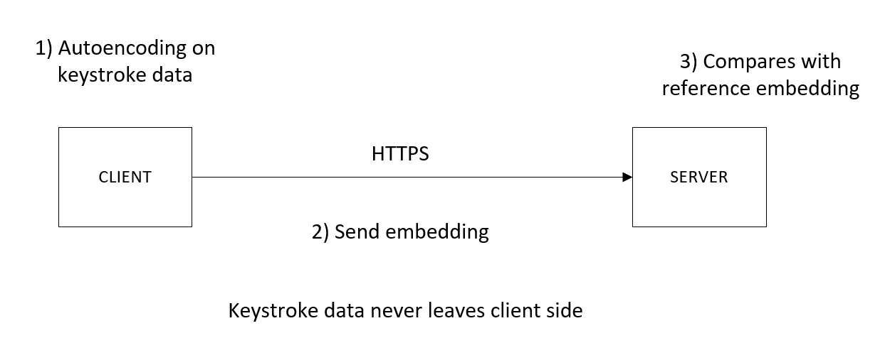

# Tempo
_by tempura for Splash Awards 2019_

## Introduction 
Tempo is JS library aimed at enhancing security on web by providing transparent
2 factor authentication through keystroke detection when typing.

This allows developers to enhance security, without introducing the hassle that 
typically comes with enhanced security. This means Tempo is simple and ready to
deploy for developers. Additionality, this enanced security comes at no cost to
users, which will encounter no change.

> **We want to enhance web security, without introducing hassle.**

## Design
We propose a non-intrusive and transparent bot detection/2-factor
authentication  solution. While the user types their credentials, keystroke
dynamic features, such as typing speed, are analysed.

### Models
Bot detection is implemented using an anomaly detection model, we can determine if the
keystrokes are from a human or bot. 

For 2-factor authentication, an autoencoder
model (similar to Facenet[1]) will be used to produce a embedding for keystroke
dynamic features. The embedding is compared to a reference to determine if the
keystrokes are characteristic of the user.

### Stack

TODO: refine & elaborate

### Project Structure
- models
    - autobot - automatic bot detection by anormaly detection
    - keyprint - user fingerprinting through keystroke dynamics
- lib - JS library to intergrate tempo with your site
